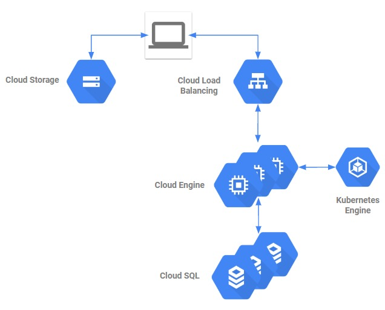
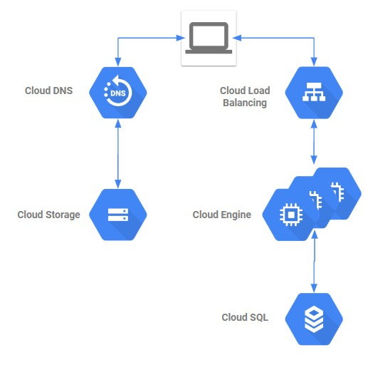
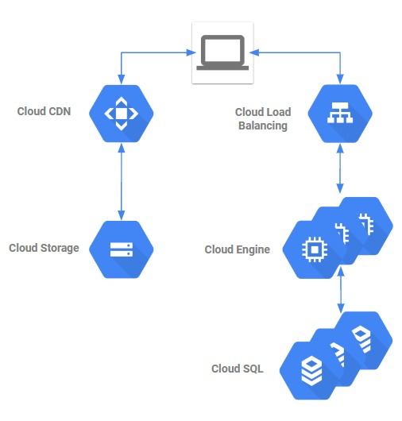
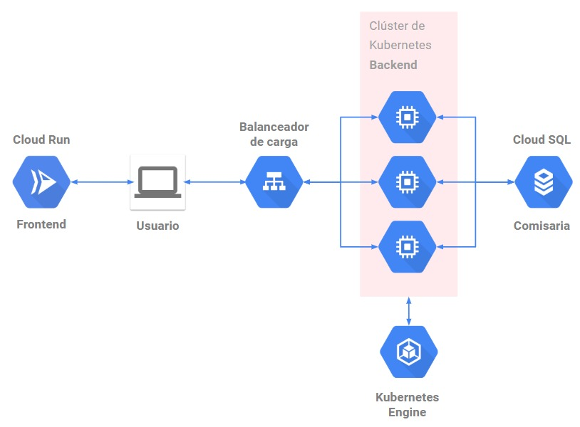

# PEP Sistemas Distribuidos 1er Semestre 2020
Autor: Alan Barahona Ruiz & Vicente Vega Toro

## Contexto

Debido a la situación de pandemia que se vive actualmente, se tiene que gobiernos alrededor del mundo han decidido restringir la movilidad de las personas, esto para que la enfermedad no se siga propagando. Debido a esto, se tiene que implementar una forma de permitir la movilidad de las personas, ya sea para que estas vayan a comprar, hacer algún trámite al banco, entre otras actividades. En el caso particular de Chile, la solución implementada corresponde a [la comisaría virtual](https://www.comisariavirtual.cl).

En esta pep, se busca seguir trabajando con lo obtenido en la pep anterior. Como anteriormente se trabajaba con un sistema de legado, este fue modificado para obtener un sistema distribuido. Esto se logro viendo cuales caracteristicas el sistema no cumplia, y realizando modificaciones sobre este para que lo cumpla.

## Caracteristicas no cumplidas anteriormente

La arquitectura anterior se puede ver a continuacion

Esta fue realizada haciendo uso de iconos de la arquitectura de AWS, pero para esta entrega, se hace uso de GCP.
 
### Escalabilidad

En temas de escalabilidad, el sistema de legado no lo cumplia, ya que no tenia ningun mecanismo de escalado o replicado. Para esto, a la arquitectura de legado se agregaria un orquestador de container por parte del backend y una replicacion en la base de datos.
 

### Transparencia

En temas de transparencia, el sistema de legado no lo cumplia, ya que no habia formas de mantener "escondido" el hecho de que se trataba de un sistema distribuido, ya que no habian proxys inversos o balanceadores de carga que sirvieran como punto de conexion a la aplicacion. Para solucionar esto, a la arquitectura se le agregaria un balanceador de carga por parte del backend y un servidor de dns para el frontend

### Disponibilidad

En temas de disponibilidad, el sistema de legado no lo cumplia, ya que la aplicacion no estaba dispersa geograficamente de forma que hubieran respaldos al haber problemas en una zona. Para esto, se agregaria un CDN al frontend, y el backend y la base de datos se replican en otras zonas geograficas.

## Caracteristicas seleccionadas
Se decide enforcarse en el backend. Las caracteristicas a implementar corresponden a escalabidad y transparencia. Para esto se hace uso de Kubernetes. La aplicacion se encuentra en ejecucion haciendo uso de Google Cloud Platform. Las tecnologías y la razón de por qué fueron usadas en este sistema corresponde a:

* [`Vue.js`](https://www.vuejs.org) como tecnología de desarrollo frontend. Fue usada debido a que se tiene conocimiento previo, por lo que desarrollar usando esta tecnología es más rápido. Gestionado por Cloud Run. Imagen de produccion disponible como `gcr.io/numeric-pilot-289101/frontend`.
* [`Node.js`](https://www.nodejs.org) como tecnología de desarrollo backend.. Fue usado debido a que se tiene conocimiento previo sobre JavaScript, por lo que desarrollar usando esta tecnología es más rápido. Por otro lado, `Node.js` rinde bastante bien en entornos de alto tráfico. Gestionado por Kubernetes. Imagen de produccion disponible como `gcr.io/numeric-pilot-289101/backend`.
* [`PostgreSQL`](https://www.postgresql.org) como base de datos. Fue usado debido a que es solicitado por el enunciado. Gestionado a traves de Cloud SQL.
* [`Kubernetes`](https://kubernetes.io/es/) como orquestador de containers. Fue usado ya que permite solventar el tema de escalabidad a traves de las replicas, y el tema de transparencia a traves de un servicio tipo balanceador de carga. Gestionado a traves de Kubernetes Engine.

La arquitectura resultante corresponde a la imagen a continuación. Vale la pena indicar que se cuenta con un cluster de kubernetes compuesto por 3 nodos, en el cual se ejecutan 4 replicas del backend de la aplicacion. El backend es expuesto al internet a traves de un baleanceador de carga

## Capacidad de respuesta del sistema

Se realizo una sola prueba, que constaba de 5000 conexiones simultaneas. Sorprendentemente, los resultados obtenidos no varian de los resultados del sistema de legado (los resultados obtenidos en el sistema de legado estan en [este link](https://docs.google.com/spreadsheets/d/1xauJOl_u-d2BEOttfCl8fi3rYAg5asfyE_gBGSF0Z60/edit?usp=sharing)), esto debido a que la base de datos hace de cuello de botella. Como se puede ver en [este link](https://cloud.google.com/sql/docs/quotas#cloud-sql-for-postgresql-connection-limits), la cantidad de conexiones concurrentes que soporta Cloud SQL son bajas. En nuestro caso, se esta limitado a 100 conexiones simultaneas, que corresponden al punto en el cual el sistema de legado empezaba a tener problemas.
