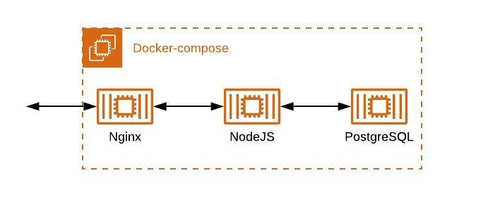

# PEP Sistemas Distribuidos 1er Semestre 2020

## Requisitos

### Software

* `docker`.
* `docker-compose`.
* `artillery.js` para las pruebas de estres.

La version de `docker` en la que se desarrollo corresponde a la version `19.03.12`, mientras que la version de `docker-compose` corresponde a `1.26.0`. Es importante que `docker-compose` soporte archivos version `3.4`.

### Variables de entorno

En el mismo directorio que el archivo `docker-compose.yml`, deben haber dos archivos en los cuales se definen variables de entorno.

```bash
#backend.env
PGUSER=#usuario de postgres
PGHOST=postgres
PGPASSWORD=#contrasena de postgres
PGDATABASE=#nombre de la base de datos
PGPORT=5432
EXPRESSPORT=3000
NODE_ICU_DATA=/app/node_modules/full-icu
```

```bash
#postgres.env
POSTGRES_PASSWORD=#contrasena de postgres
POSTGRES_USER=#usuario de postgres
POSTGRES_DB=#nombre de la base de datos
```

## Arquitectura




## Analisis del sistema

Caracteristica | Descripcion | Lo posee la arquitectura?
--- | --- | ---
Poner Recursos a disposicion | Facilitar a los usuarios y aplicaciones acceder a recursos remotos de manera eficiente | x
Transparencia de la distribucion | Esconder el hecho de que procesos y recursos estan fisicamente distribuidos en multiples computadores | El sistema no es transparente, ya que no esta configurado para estar en diferentes maquinas (ya que usa una red interna creada por `docker` para comunicar el back con la base de datos). Ademas, no ofrece transparencia en sus multiples dimensiones como: acceso, ubicacion, migracion, re-localizacion, replicacion, concurrencia, fallo, persistencia.
Apertura | Ofrece servicios bajo reglas estandares | El sistema si esta abierto, ya que la comunicacion entre el back y el front se realiza a traves del estandar API REST.
Escalabilidad | Capacidad de un sistema de escalar  vertical u horizontalmente. | El sistema no es escalable, ya que no posee cache, ni esta replicado ni particionado

## Capacidad de respuesta del sistema

Para la analizar la capacidad de respuesta del sistema, se realizo una prueba de estres usando [artillery](https://artillery.io). Los pruebas se hicieron simulando 100, 250, 500, 1000, 2500 y 5000 conexiones simultaneas. Para la prueba, se levanto una maquina virtual en Google Cloud, correspondiente a una maquina n1-standard-1 con 1 vCPU y 3,75 GB de RAM. Tambien se tiene que considerar que la region donde la maquina virtual se levanto corresponde a Iowa, Estaods Unidos, para poder entender los tiempos de respuesta obtenidos. [Los resultados de la prueba de estres se encuentran en esta planilla](https://docs.google.com/spreadsheets/d/1xauJOl_u-d2BEOttfCl8fi3rYAg5asfyE_gBGSF0Z60/edit?usp=sharing).

La planilla muestra:

* Cantidad de casos realizados
* Casos completados con exito
* Promedio de respuestas por segundo, 
* Tiempo de respuesta minimo
* Tiempo de repuesta maximo
* Tiempo de respuesta promedio
* Cantidad de errores
* Detalle de los errores

Cabe notar que el tiempo de respuesta maximo que se obtiene con 500 peticiones es 60 veces mayor que con 250 peticiones, por lo que el promedio de respuestas por segundo deja de tener significancia al haber valores atipicos que se alejan tanto de la media.

