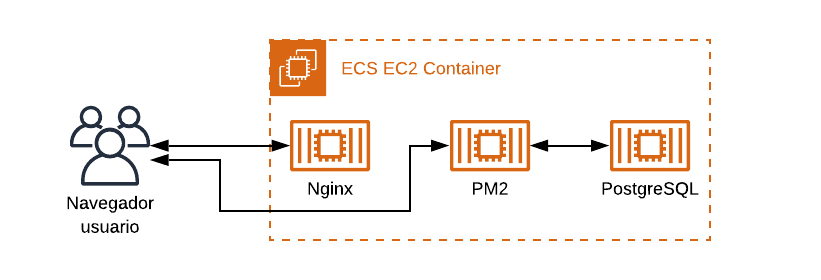

# PEP Sistemas Distribuidos 1er Semestre 2020
Autor: Alan Barahona Ruiz

## Requisitos

### Software

* `docker`.
* `docker-compose`.
* `artillery.js` para las pruebas de estrés.

La version de `docker` en la que se desarrollo corresponde a la version `19.03.12`, mientras que la version de `docker-compose` corresponde a `1.26.0`. Es importante que `docker-compose` soporte archivos version `3.4`.

### Variables de entorno

En el mismo directorio que el archivo `docker-compose.yml`, deben haber dos archivos en los cuales se definen variables de entorno.

```bash
#backend.env
PGUSER=#usuario de postgres
PGHOST=postgres
PGPASSWORD=#contrasena de postgres
PGDATABASE=#nombre de la base de datos
PGPORT=5432
EXPRESSPORT=3000
NODE_ICU_DATA=/app/node_modules/full-icu
```

```bash
#postgres.env
POSTGRES_PASSWORD=#contrasena de postgres
POSTGRES_USER=#usuario de postgres
POSTGRES_DB=#nombre de la base de datos
```

## Contexto

Debido a la situación de pandemia que se vive actualmente, se tiene que gobiernos alrededor del mundo han decidido restringir la movilidad de las personas, esto para que la enfermedad no se siga propagando. Debido a esto, se tiene que implementar una forma de permitir la movilidad de las personas, ya sea para que estas vayan a comprar, vayan a hacer algún trámite al banco, entre otros. En el caso particular de Chile, la solución implementada corresponde a [la comisaría virtual](https://www.comisariavirtual.cl).

En esta pep, se busca replicar la solución implementada por el gobierno de Chile, con la restricción que debe ser diseñado como un sistema de legado. Esto para, en una pep siguiente, implementar características de sistemas distribuidos a la arquitectura presentada en este repositorio y realizar comparaciones entre los resultados obtenidos a partir de un sistema de legado y uno que implementa técnicas de sistemas distribuidos.

## Arquitectura

Las tecnologías y la razón de por qué fueron usadas en este sistema corresponde a:
* [`Vue.js`](https://www.vuejs.org) como tecnología de desarrollo frontend. Fue usada debido a que se tiene conocimiento previo, por lo que desarrollar usando esta tecnología es más rápido.
* [`Node.js`](https://www.nodejs.org) como tecnología de desarrollo backend.. Fue usado debido a que se tiene conocimiento previo sobre JavaScript, por lo que desarrollar usando esta tecnología es más rápido. Por otro lado, `Node.js` rinde bastante bien en entornos de alto tráfico.
* [`PostgreSQL`](https://www.postgresql.org) como base de datos. Fue usado debido a que es solicitado por el enunciado.

La arquitectura resultante corresponde a la imagen a continuación.


## Análisis del sistema

Característica | Descripción | Lo posee la arquitectura?
--- | --- | ---
Poner Recursos a disposición | Facilitar a los usuarios y aplicaciones acceder a recursos remotos de manera eficiente | x
Transparencia de la distribución | Esconder el hecho de que procesos y recursos están físicamente distribuidos en múltiples computadores | El sistema no es transparente, ya que no está configurado para estar en diferentes maquinas (ya que usa una red interna creada por `docker` para comunicar el back con la base de datos). Además, no ofrece transparencia en sus múltiples dimensiones como: acceso, ubicación, migración, re-localización, replicación, concurrencia, fallo, persistencia.
Apertura | Ofrece servicios bajo reglas estándares | El sistema si esta abierto, ya que la comunicación entre el back y el front se realiza a través del estándar API REST.
Escalabilidad | Capacidad de un sistema de escalar  vertical u horizontalmente. | El sistema no es escalable, ya que no posee cache, ni esta replicado ni particionado

## Capacidad de respuesta del sistema

Para la analizar la capacidad de respuesta del sistema, se realizo una prueba de estrés usando [artillery](https://artillery.io). Las pruebas se hicieron simulando 100, 250, 500, 1000, 2500 y 5000 conexiones simultaneas. Para la prueba, se levanto una maquina virtual en Google Cloud, correspondiente a una maquina n1-standard-1 con 1 vCPU y 3,75 GB de RAM. Tambien se tiene que considerar que la region donde la maquina virtual se levanto corresponde a Iowa, Estados Unidos, para poder entender los tiempos de respuesta obtenidos. [Los resultados de la prueba de estrés se encuentran en esta planilla](https://docs.google.com/spreadsheets/d/1xauJOl_u-d2BEOttfCl8fi3rYAg5asfyE_gBGSF0Z60/edit?usp=sharing).

La planilla muestra:

* Cantidad de casos realizados
* Casos completados con éxito
* Promedio de respuestas por segundo, 
* Tiempo de respuesta mínimo
* Tiempo de repuesta máximo
* Tiempo de respuesta promedio
* Cantidad de errores
* Detalle de los errores

Cabe notar que el tiempo de respuesta máximo que se obtiene con 500 peticiones es 60 veces mayor que con 250 peticiones, por lo que el promedio de respuestas por segundo deja de tener significancia al haber valores atípicos que se alejan tanto de la media.